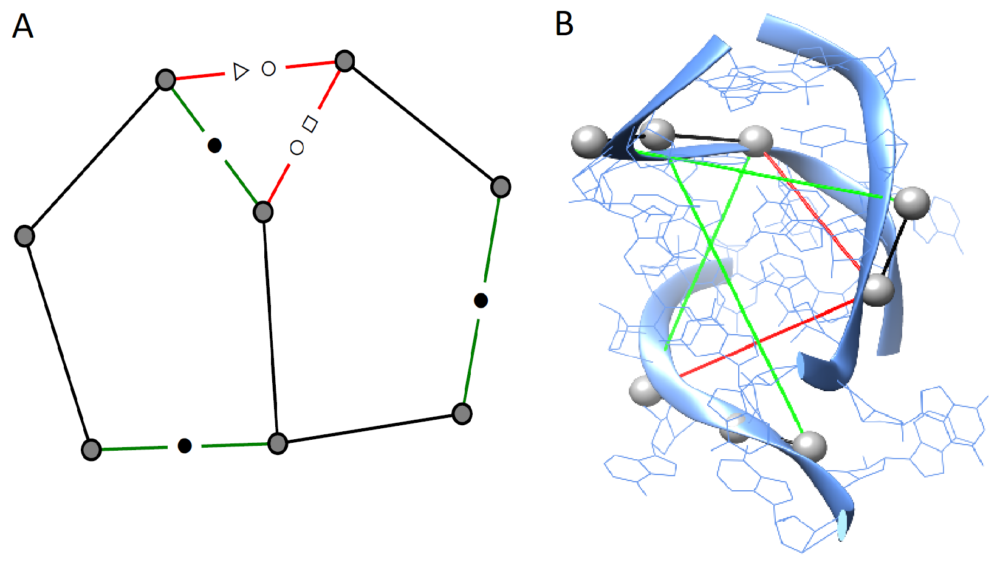

# RNAGlib

## Associated Repositories:
[VeRNAl](https://github.com/cgoliver/vernal)

[RNAMigos](https://github.com/cgoliver/RNAmigos)

# 1. Data Preparation
Networkx graphs which are sliced into portions containing RNA interfaces and their respective complement counterparts. Graphs are Augmented Base Pairing Networks. Here is an example of one overlayed on a PDB structure. Backbones are in white, canonical Watson-Crick bonds are in green and non-canonical bonds are in red.

To generate this data:
1. Retrieve a representative set of RCSB PDB structures.
2. Find all interfaces within structures.
3. Slice native RNA graphs into interface and complement parts.

The `prepare_data` package contains all the scripts to do these tasks. The process can take some time so alternatively the following pre-built datasets can be downloaded from MEGA:

|	Dataset 	    |Graphs | Edges| Nodes  |Avg. Nodes | Avg. Edges|Links|
|---------------------------|-------:|------:|--------:|-------:|-----------:|-------|
|ALL                         |2679   | 447225 | 641968  |166.9|239.6|[link](https://mega.nz/file/hX4CVRib#ukoA6xaHdY14Vf9CIY7CXlFtycAmBIk16j6Oa65yJZo)|
|ALL complement              |9034   | 195395 | 228261 | 21.6 |25.3||
|RNA-Protein                 |2750   | 411487 | 587961 | 149.6|213.8|[link](https://mega.nz/file/9WpXHSab#JMtoU3RU-SZRqf4d34n3LRPHQNm2DqSwoIj5EUFtWrw)|
|RNA-Protein complement      |8265   | 241611 | 322324 | 29.2 |39.0||
|RNA-RNA                     |2737   | 59333  | 79116  | 21.7 |28.9|[link](https://mega.nz/file/xHpl3CIK#miMH5dVsqpLmJGmQSuR3qLCPhNmpXFOEVIhYKiOESuo)|
|RNA-RNA complement          |2483   | 55001  | 70551  | 22.2 |28.4||
|RNA-Small\_Mol.             |166    | 981    | 1004   | 5.9 |6.0|[link](https://mega.nz/file/lDhhTQZR#ovE1oZw1s6bolMA-AkMoljf6i4fV5Ih3yBme5RgjOGY)|
|RNA-Small\_Mol. complement  |140    | 973    | 1038   | 7.0|7.4||
|RNA-Ion                     |572    | 3490   | 3764   | 6.1  |6.6|[link](https://mega.nz/file/cGpFXC6J#NTOQ97TRmY9dzFfx3aYxk-ifJykxms1JQvfNGoSAj3A)|
|RNA-Ion complement          |493    | 3691   | 3993   | 7.5  |8.1||

## 1.1 Retrieve a Representative Set of PDB Structures
To avoid redundancies in the training data the BGSU representative set of RNAs are used.
They can be downloaded from [here](http://rna.bgsu.edu/rna3dhub/nrlist/release/3.145) [1]

Make a directory to store the structures

`mkdir data/structures`

Then run the following command to retrieve the PDB structures from the RCSB database

`python prepare_data/retrieve_structures.py <BGSU file> data/structures`

## 1.2 Find Interfaces in the PDB structures and Slice their RNA graphs
Make a directory for the native graphs and the interface graphs

`mkdir data/graphs`

`mkdir data/graphs/interfaces`

`mkdir data/graphs/native`

Download the set of native RNA graphs from [here]() and extract the compressed files into the `native` directory.

Now run `prepare_data/main.py` to find all the interfaces and slice the graphs. This process will take a few hours.

`python prepare_data/main.py data/graphs/interfaces`

#### Note
- The an optional parameter `-t` can be added to specify the RNA interaction type. The default is all but can be any of `rna protein ion ligand`. Use a string in quotations seperated by spaces for multple interaction types.
- Once the PDB interfaces are found, if you would like to run the script again use `-interface_list_input interface_residues_list.csv` option to use the interfaces computed from previous call and speed up execution.

# References
1. Leontis, N. B., & Zirbel, C. L. (2012). Nonredundant 3D Structure Datasets for RNA Knowledge Extraction and Benchmarking. In RNA 3D Structure Analysis and Prediction N. Leontis & E. Westhof (Eds.), (Vol. 27, pp. 281–298). Springer Berlin Heidelberg. doi:10.1007/978-3-642-25740-7\_13

