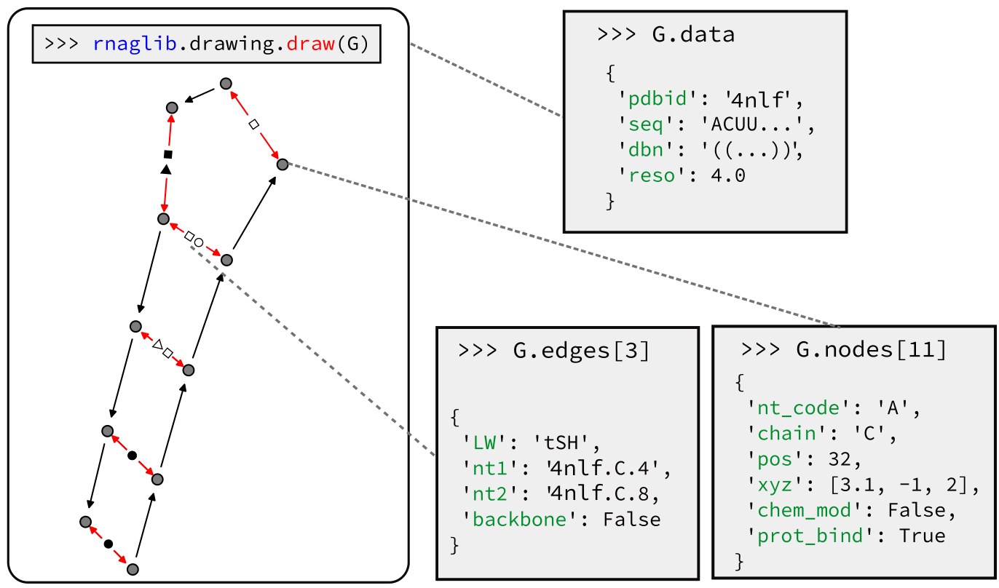

# RNAGlib

`RNAglib` is a Python package for studying RNA 2.5D structures. Functionality includes automated data loading, analysis, visualization, ML model building and benchmarking.

* What are RNA 2.5D structures?

RNA 2.5D structures are discrete graph-based representations of atomic coordinates derived from techniues such as X-ray crystallography and NMR. 
This type of representation encodes all possible base pairing interactions which are known to be crucial for understanding RNA function.

* Why use RNA 2.5D data?

The benefit is twofold.
When dealing with RNA 3D data, a representation centered on base pairing is a very natural prior which has been shown to carry important signals for complex interactions, and can be directly interpreted. 
Second, adopting graph representations lets us take advantage of many powerful algorithmic tools such as graph  neural networks and graph kernels.

* What type of functional data is included?

The graphs are annotated with graph, node, and edge-level attributes. These include, but are not limited to:

* Secondary structure (graph-level)
* Protein binding (node-level)
* Small molecule binding (node-level)
* Chemical modifications (node-level)
* 3-d coordinates(node-level)
* Leontis-westhof base pair geometry classification (edge-level)


## Package Structure


* `/prepare_data/`: processes raw PDB structures and builds a database of 2.5D graphs with full structural annotation
* `/RNAGlib/data_loading`: custom PyTorch dataloader implementations
* `/RNAGlib/drawing`: utilities for visualizing 2.5D graphs 
* `/RNAGlib/ged`: custom graph similarity functions 
* `/RNAGlib/kernels`: custom local neighbourhood similarity functions 
* `/RNAGlib/learning`: ML model implementations 

## Data scheme




## Installation

```
pip install rnaglib
```

## Example usage


### Basic supervised model


### Unsupervised model


### Visualization


## Associated Repositories:
[VeRNAl](https://github.com/cgoliver/vernal)

[RNAMigos](https://github.com/cgoliver/RNAmigos)

# References
1. Leontis, N. B., & Zirbel, C. L. (2012). Nonredundant 3D Structure Datasets for RNA Knowledge Extraction and Benchmarking. In RNA 3D Structure Analysis and Prediction N. Leontis & E. Westhof (Eds.), (Vol. 27, pp. 281–298). Springer Berlin Heidelberg. doi:10.1007/978-3-642-25740-7\_13

