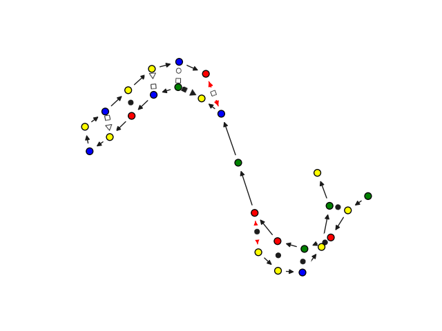
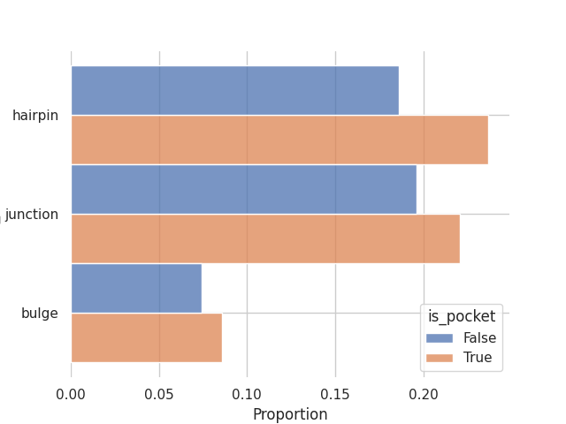
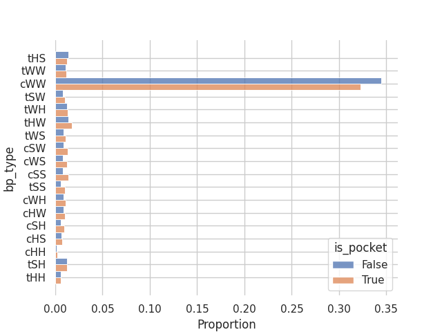

Working with 2.5D graphs
~~~~~~~~~~~~~~~~~~~~~~~~~

Now that we know :doc:`what is an RNA 2.5D graph<../data_reference/what_is>` we can inspect the graph using `rnaglib`.

Fetching hosted graphs
--------------------------

The libray ships with some pre-built datasets which you can download with the following command line::

        $ rnaglib_download

This will download the default data distribution to `~/.rnaglib`

To see the list of available PDBs you downloaded, use:

.. code-block:: python

   from rnaglib.utils import available_pdbids
   from rnaglib.data_loading import rna_from_pdbid
   # returns a list of PDBIDs
   pdbids = available_pdbids()
   # get the first RNA by PDBID
   rna = rna_from_pdbid(pdbids[0])

.. warning::

        The list of available PDBs depends on which data build you want to use. See :doc:`preparing data<../data_reference/build_data>` for more info on versioning and data build arguments. You can pass these arguments to the `available_pdbids(redundancy='all', version='0.0.0', annotated=True)` for non-default builds.

Overview of the 2.5D Graphs
-----------------------------

First, let us have a look at the 2.5d graph object from a code perspective.
We use networkx to store the RNA information in a `nx.DiGraph` directed graph object.
Once the graphs are downloaded, they can be fetched directly using their PDBID.

Since nodes represent nucleotides, the node data dictionary will include features such as nucleotide type,
position, 3D coordinates, etc...
Nodes are assigned an ID in the form ``<pdbid.chain.position>``.
Using node IDs we can access node and edge attributes as dictionary keys.

.. code-block:: python

   >>> from rnaglib.data_loading import rna_from_pdbid
   >>> rna = rna_from_pdbid("4nlf")
   >>> rna['rna'].nodes['4nlf.A.2647']
    {'index': 1, 'index_chain': 1, 'chain_name': 'A', 'nt_resnum': 2647, 'nt_name': 'U', 'nt_code': 'U',
     'binding_protein': None, 'binding_ion': None, 'binding_small-molecule': None}

The RNA 2.5D graph contains a rich set of annotations.
For a complete list of these annotations see :doc:`this page<../data_reference/rna_ref>`.

Visualization
-------------

To visualize the 2.5D graphs in the format described above, we have implemented a drawing toolbox with several
functions. The easiest way to use it in your application is to call ``rnaglib.drawing.draw(graph, show=True)``.
A functioning installation of Latex is needed for correct plotting of the graphs. If no installation is detected,
the graphs will be plotted using the LaTex reduced features that ships with matplotlib.

.. code-block:: python

    >>> from rnaglib.drawing import rna_draw
    >>> rna_draw(G, show=True, layout="spring")

In the next two examples we will show how you can make use of these annotations to study chemical modifications and RNA-protein binding sites.

Analyzing RNA-small molecule binding sites
-------------------------------------------------------

In this short example we will compute some statistics to describe the kinds of structural features around RNA-small molecule binding pockets using RNAGlib.

Let's get our graphs. We are using the default data build which contains whole non-redundant RNA structures.
We will iterate over all available non-redundant RNAs and extract residues near small molecules.

.. code-block:: python

        from rnaglib.utils import available_pdbids
        from rnaglib.data_loading import rna_from_pdbid

        pockets = []
        for i,G in enumerate(graphs):
                try:
                    pocket = [n for n, data in G.nodes(data=True) if data['binding_small-molecule'] is not None]
                    # sample same number of random nucleotides 
                    non_pocket = random.sample(list(G.nodes()), k=len(pocket))
                except KeyError as e:
                    continue
                if pocket:
                    pockets.append((pocket, non_pocket, G))
                else:
                    # no pocket found
                    pass

Now we have a list of pockets where each is a thruple of a list of pocket nodes, a list of non-pocket nodes, and the parent graph.
Let's collect some stats about these residues.
Namely, what base pair types and secondary structure elements they are involved in.

.. code-block:: python

        bps, sses = [], []

        for pocket, non_pocket, G in pockets:
            for nt in pocket:
                # add edge type of all base pairs in pocket
                bps.extend([{'bp_type': data['LW'],
                             'is_pocket': True} for _,data in G[nt].items()])
                # sse key is format '<sse type>_<id>'
                node_data = G.nodes[nt]
                if node_data['sse']['sse'] is None:
                    continue
                sses.append({'sse_type': node_data['sse']['sse'].split("_")[0],
                             'is_pocket': True})

            # do the same for non-pocket
            for nt in non_pocket:
                # add edge type of all base pairs in pocket
                bps.extend([{'bp_type': data['LW'],
                             'is_pocket': False} for _,data in G[nt].items()])
                # sse key is format '<sse type>_<id>'
                node_data = G.nodes[nt]
                if node_data['sse']['sse'] is None:
                    continue
                sses.append({'sse_type': node_data['sse']['sse'].split("_")[0],
                             'is_pocket':False})

        # for convenience convert to dataframe
        bp_df = pd.DataFrame(bps)
        sse_df = pd.DataFrame(sses)

Finally we can draw some plots of the base pair type and secondary structure element distribution around small molecule binding sites.

.. code-block:: python

        # remove backbones
        bp_df = bp_df.loc[~bp_df['bp_type'].isin(['B35', 'B53'])]

        sns.histplot(y='bp_type', hue='is_pocket', multiple='dodge', stat='proportion', data=bp_df)
        sns.despine(left=True, bottom=True)
        plt.savefig("bp.png")
        plt.clf()

        sns.histplot(y='sse_type', hue='is_pocket', multiple='dodge', stat='proportion', data=sse_df)
        sns.despine(left=True, bottom=True)
        plt.savefig("sse.png")
        plt.clf()

This is the distribution of secondary structures in binding pockets and in a random sample of residues:

And the same but for the different LW base pair geometries:

From this small experiment we confirm a `property <https://academic.oup.com/nar/article/38/18/5982/1065889>`_ of RNA binding sites which is that they tend to occur in looping regions with a slight tendency towards non-canonical (non-CWW) base pair geometries. 

:download:`Download source code for this example. <../code/cb.py>`

Aligning two RNA graphs: Graph Edit Distance (GED)
-------------------------------------------------------

GED is the gold standard of graph comparisons. We have put our ged implementation as a part of networkx, and offer
in :doc:`../code_index/rnaglib.algorithms` the weighting scheme we propose to compare 2.5D graphs.
One can call ``rnaglib.algorithms.ged()`` on two graphs to compare them.
However, due to the exponential complexity of the comparison, the maximum size of the graphs should be around ten nodes, making it more suited for comparing graphlets or subgraphs.

.. code-block:: python

    >>> from rnaglib.algorithms import ged
    >>> from rnaglib.data_loading import rna_from_pdbid
    >>> G = rna_from_pdbid("4nlf")
    >>> ged(G, G)
    ... 0.0

Using your own local RNA structures
----------------------------------------

If you have an mmCIF containing RNA stored locally and you wish to build a 2.5D graph that can be used in RNAglib you
can use the ``prepare_data`` module.
To do so, you need to have ``x3dna-dssr`` executable in your ``$PATH`` which requires a `license <http://x3dna.org/>`.
The first option is to use the library from a python script, following the example :

.. code-block:: python

    >>> from rnaglib.prepare_data import cif_to_graph

    >>> pdb_path = '../data/1aju.cif'
    >>> graph_nx = cif_to_graph(pdb_path)

Another possibility is to use the shell function that ships with rnaglib.

::

    $ rnaglib_prepare_data  --one_mmcif $PATH_TO_YOUR_MMCIF -O /path/to/output

